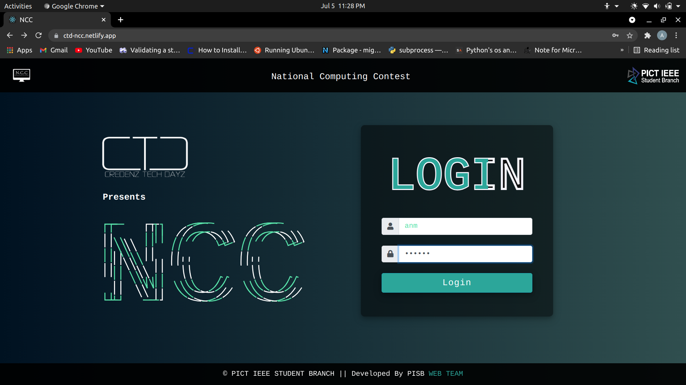
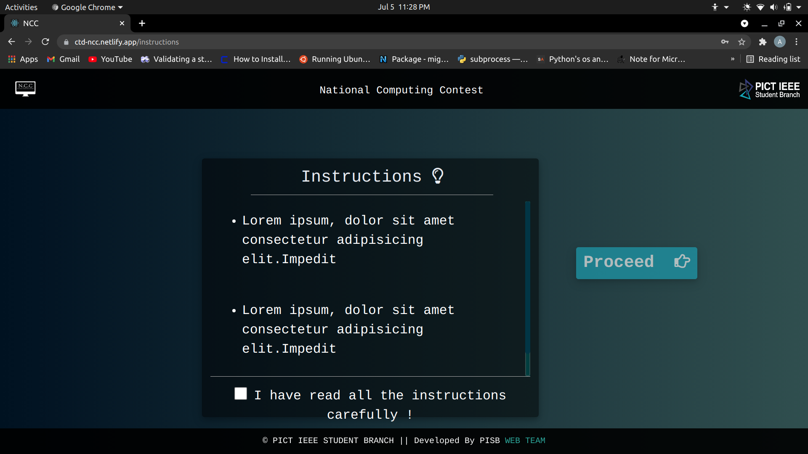
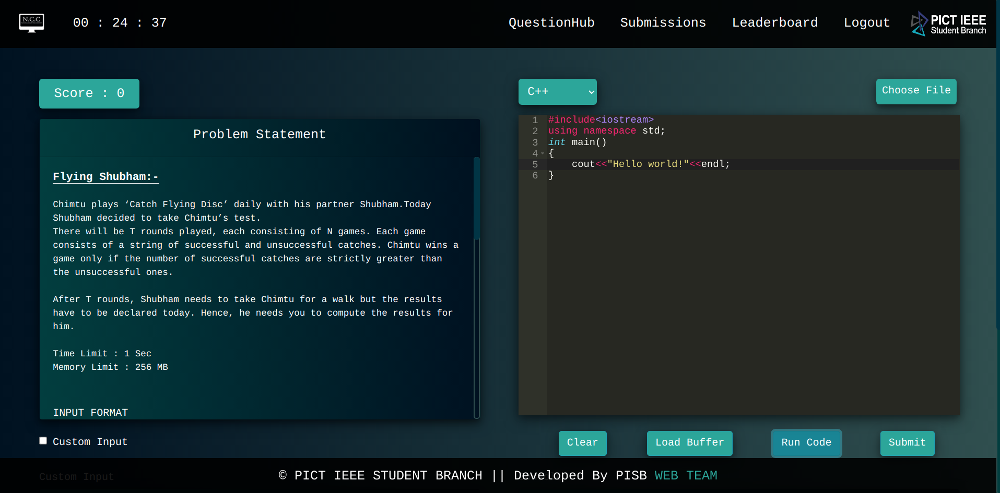
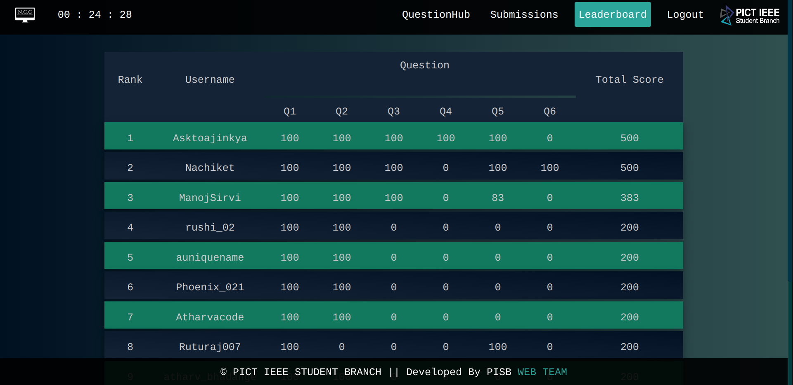
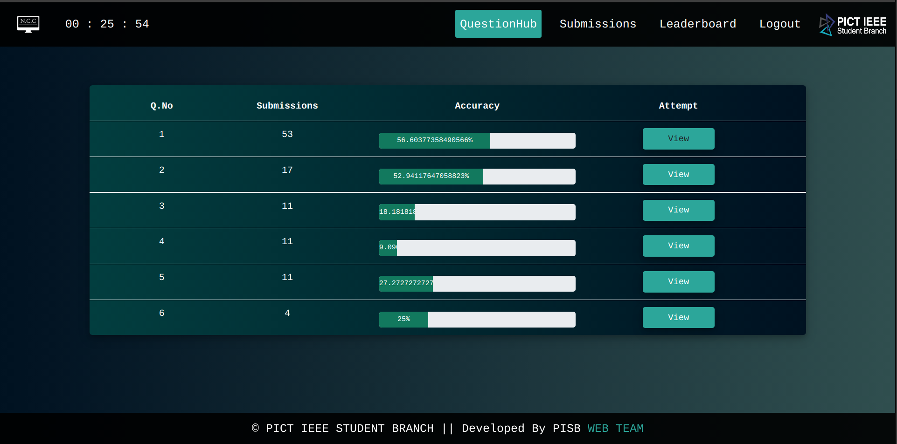
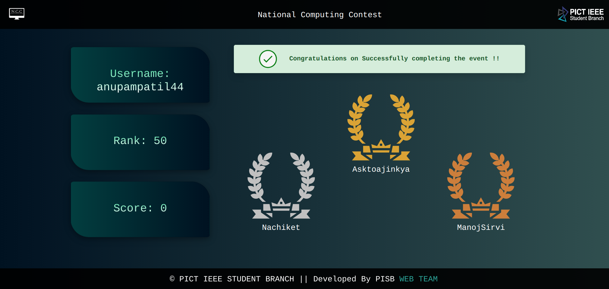
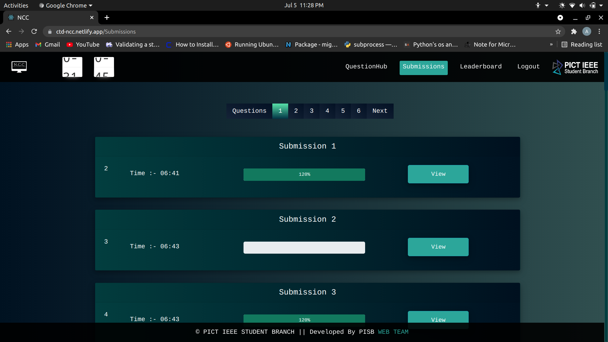
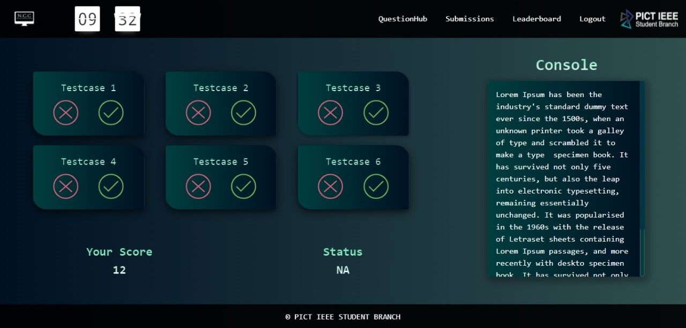

# NCC_Frontend:
This Repository contains the Frontend UI for National Computing Contest 2021, part of Credenz Tech Dayz (CTD).
Done in ReactJS.

## A Glimpse of the User Interface:
#### 1) Login Page -

### 2) Instructions Page -

### 3) Coding Page -

### 4) LeaderBoard -

### 5) Question Page -

### 6) Results Page -

### 7) Submissions Page -

### 8) Testcase Evaluation Page -

